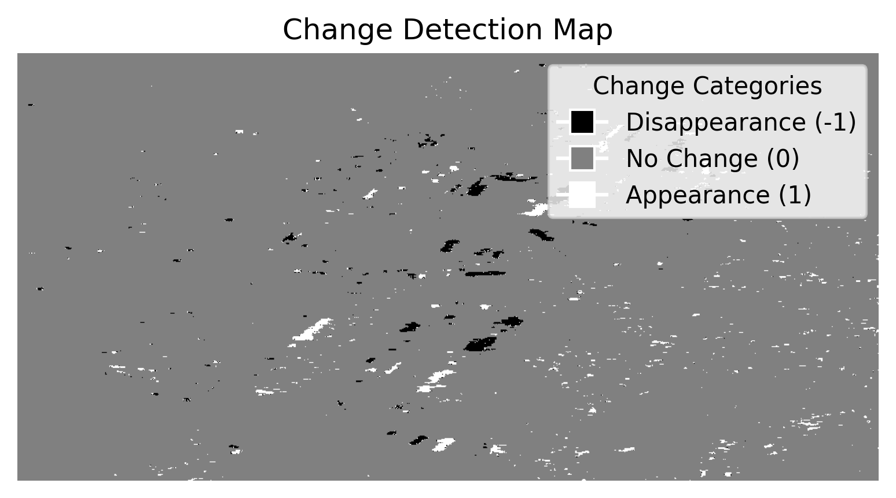

## Change Detector

## Overview

Change Detector is a lightweight and quick change detector. This Python package has been designed to detect changes between two satellite images, specifically for Synthetic Aperture Radar (SAR) data. By leveraging SAR amplitude information and the Isolation Forest algorithm, this package allows users to identify areas of change effectively. It is particularly useful for those working in remote sensing, environmental monitoring, agriculture, or urban planning.

The function returns a detailed change map that highlights regions of appearance and disappearance, helping users gain insights into landscape dynamics.

## Features

- Detects changes between two SAR images using amplitude information.
- Identifies changes as either appearance or disappearance.
- Uses Isolation Forest to classify areas of significant change.
- Customizable parameters such as filter size and contamination level for fine-tuning.

Inputs are two satellite images (as np arrays) with the same size and from the same area. Then the code computes a ratio using amplitudes SAR information* and therefore Isolation Forest.

* The ratio of the arithmetic mean to the geometric mean of the spatially averaged intensities. The asymmetric term focuses more specifically on amplitude variations.
It helps to assess how the arithmetic mean of the intensities compares to their geometric mean. A value close to 1 would indicate an almost perfect equality between these means, suggesting uniformity in the amplitudes of the analyzed images.

## References
This ratio computation is inspired by the work described in the following paper:

> J. Ni, C. López-Martínez, Z. Hu, et F. Zhang,  
> "**Multitemporal SAR and Polarimetric SAR Optimization and Classification: Reinterpreting Temporal Coherence**,"  
> *IEEE Transactions on Geoscience and Remote Sensing*, vol. 60, pp. 1-17, 2022, Art no. 5236617.  
> [doi: 10.1109/TGRS.2022.3214097](https://doi.org/10.1109/TGRS.2022.3214097)

## Installation

You can install the package with:

    pip install SAR_change_detector

## Requirements

The package depends on the following Python packages:

    numpy
    scikit-learn
    scipy

# Usage

## Example

You can download the tutorial folder or directly test the function on Google Colab [here](https://colab.research.google.com/github/Selimgit/SAR_change_detector/blob/main/examples/example_change_detection.ipynb).

### Inputs Images

## Results

The output is a change map where:

    -1 indicates areas where changes involve disappearance.
    0 indicates no change.
    1 indicates areas where changes involve appearance.

### Change detection results

## 3 Parameters

    first_image, second_image: The two SAR satellite images to compare. These should be np.array objects with the same size and from the same region of interest.

    filter_size: The size of the filter used in the asymmetric term computation (default is (3, 3)).

    contamination: The proportion of points to consider as anomalies for Isolation Forest. Default is 0.02.

## Contributing

If you want to contribute to change_detector, feel free to fork the repository and submit a pull request. Suggestions, issues, and feature requests are also very welcome!

## License

This project is licensed under the **GNU Affero General Public License v3.0 (AGPL-3.0)**.

You are free to use, modify, and distribute this code, provided that any modifications and derived works are also licensed under AGPL-3.0. If you use this code in a publicly accessible service (such as a web service), you must make your modified source code available under the same terms.

For more details, see the `LICENSE` file or visit [GNU's official site](https://www.gnu.org/licenses/agpl-3.0.en.html).
